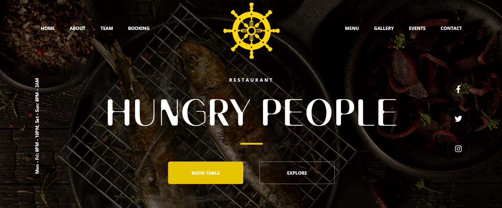

# Restaurant landing page #

## Technology stack ##
* **HTML**
* **CSS/SASS** *(SCSS)*:
  * flex,
  * responsive design,
  * media queries,
  * constants,
  * mixins,
  * placeholders,
  * folders and files architecture,
  * final main.scss file with imports of all other files,
  * animations (logo, burger button, navigation menu at low screen resolution);
* **BEM**;
* **JavaScript** *(ECMAScript 6/7/8)*:
  * modules (import/export of components),
  * classes,
  * event delegation,
  * render elements,
  * try/catch,
  * destructuring assignment,
  * arrow functions,
  * rest parameters,
  * spread syntax,
  * default arguments value and etc.
* **Webpack** *(webpack.config.js)*:
  * plugins,
  * loaders,
  * modes (dev/prod),
  * final bundle.

## Functionality ##
- Navigation:
  - smooth scrolling to the anchors on the navigation buttons click,
  - smooth scrolling to the first section on the arrow button click,
  - listener is on the navigation block - determination of a clicked link occurs by event delegation;
  - event target check;
- Inputs:
  - text,
  - email,
  - telephone,
  - select,
  - data,
  - time,
  - textarea;
- Bootstrap carousel;
- Menu selection;
  - the menu list is initially empty,
  - render the menu list depending on the selected category,
  - listener is on the menu categories block - determination of a selected category occurs by event delegation,
  - event target check;
- Google Maps iframe;
- Full responsive:
  - Navigation:
    - the burger button appears at low screen resolution,
    - the navigation menu appears when the burger button is clicked,
    - the overlay appears with the navigation menu,
    - if the navigation link or the overlay is clicked, they will both disappear;
  - Layout:
    - dynamic changing of columns width,
    - changing of flex-direction in columns depending on current screen resolution;
  - Images:
    - all images are responsive;
  - Fonts:
    - changing of font-size depending on current screen resolution.
